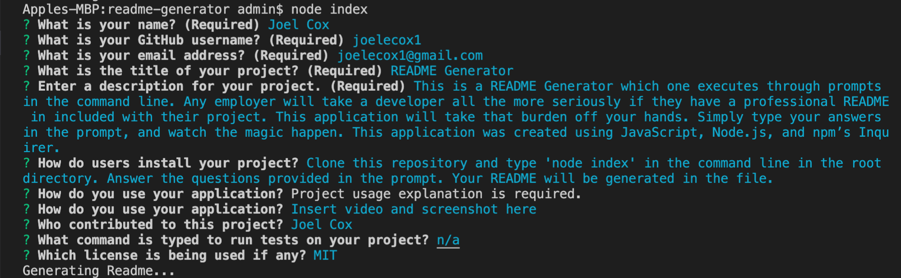

# README Generator
  
  
  ## Description
  
  This is a README Generator which one executes through prompts in the command line. Any employer will take a developer all the more seriously if they have a professional README in included with their project. This application will take that burden off your hands. Simply type your answers in the prompt, and watch the magic happen. This application was created using JavaScript, Node.js, and npm’s Inquirer.

  ## Table of Contents

  * [Installation](#installation)
  * [Usage](#usage)
  * 
  * [Contributors](#contributors)
  * [Questions](#questions)
  
  ## Installation

  [README Generator](https://joelecox1.github.io/readme-generator/.)

  Clone this repository and type 'node index' in the command line in the root directory. Answer the questions provided in the prompt. Your README will be generated in the file.

  ## Usage

  [Instructional video for application usage](https://youtu.be/wP15ASNPvhw)

  

  ## Contributors

  Joel Cox

  ## License
      
        This project is licensed under the MIT License.
      

  ## Test

  Run the following commad to run tests on your application:

  n/a

  ## Questions

  If there are any further questions, please feel free to reach out to me. 

  - Email: joelecox1@gmail.com
  - GitHub: [joelecox1](https://github.com/joelecox1)
